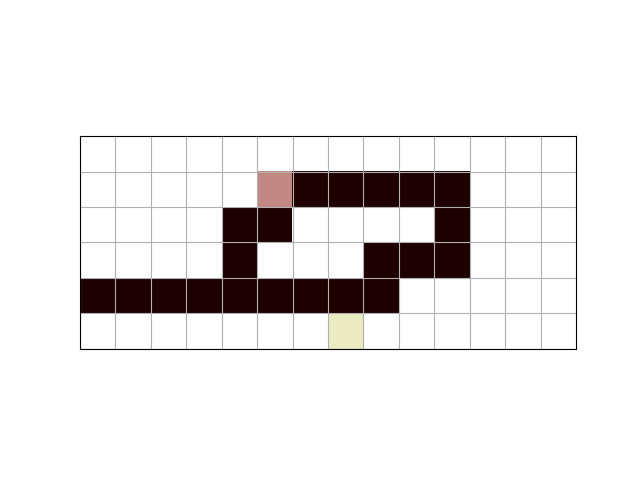
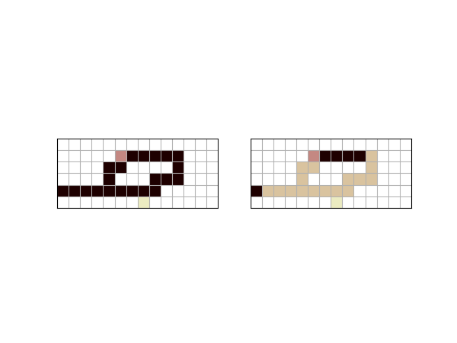

# 1. Algoritmos de búsqueda

Se presentan códigos donde se implementan algoritmos de búsqueda aplicados sobre laberintos. Para ello, se crean módulos (la documentación se presenta en la sección [3. Documentación](#3-documentación)), los cuales, a partir de laberintos creados a mano (como se muestra en la [3. Documentación Maze](#maze)), generan grafos donde cada nodo son los píxeles que representan el camino del laberinto, y las conexiones representan los puntos siguientes.

# 2. Instalación

```
git clone
python3 -m venv env
source env/bin/activate
pip3 install -r requirements.txt
```


# 3. Documentación

1. Se debe importar el módulo ```MazeGraph```:

    ```python
    from MazeGraph import *
    ```

2. El módulo cuenta con las clases:
    - ```UndirectedGraph```
    - ```Node```
    - ```Edge```
    - ```Maze```

    ```UndirectedGraph``` permite crear grafos no dirigidos, pero a su vez necesita instancias de las clases ```Node``` y ```Edge```. Para más información, recomiendo ver los videos de https://www.youtube.com/@PepeCantoralPhD, ya que de estos videos resulta la creación de estas clases ```UndirectedGraph```, ```Node``` y ```Edge```.

    ## Maze

    ```Maze``` es la clase que permite crear laberintos u objetos de tipo Maze.

    ```python
    class Maze(maze_str, starting_point_name, end_point_name)
    ```

    ### Atributos

    - `maze_str`: laberinto creado previamente

      ```python
      maze_str = """
      ##############
      #####B########
      #  #  #### ###
      # ## ###   ###
               #####
      #######A######
      """
      ```

    - `starting_point_name`: nombre del punto donde iniciará el recorrido en el laberinto creado.

    - `end_point_name`: nombre del punto de llegada en el laberinto.

    ##### Ejemplo

    ```python
    M = Maze(maze_str, 'start', 'end')
    ```

    ## Métodos

    - ```image_maze```: genera una imagen del laberinto creado

      ##### Ejemplo

      ```python
      M.image_maze()
      ```
      

    - ```maze_to_graph```: devuelve un objeto de tipo grafo a partir del laberinto ingresado

      ##### Ejemplo

      ```python
      graph = M.maze_to_graph()
      ```

      Al ser un objeto grafo tiene todos los métodos de ```UndirectedGraph```, ```Node``` y ```Edge```. Si hacemos un `print` al objeto `graph`, este retornará los nodos con sus respectivas conexiones. Finalmente, sobre el objeto `graph`, se puede aplicar algoritmos de búsqueda.

    - ```solution_search_image```: genera una imagen del camino recorrido por el algoritmo de búsqueda.

      ```python
      M.solution_search_image(path)
      ```

      - ```path```: ruta que hizo el algoritmo (lista)

      ##### Ejemplo

      ```python
      path = search(graph, 'start', 'start') # algoritmo de búsqueda retorna una lista con el nombre de los nodos

      print(path)

      M.solution_search_image(path)
      ```

      

      Nota: en el archivo main.py se aplica el algoritmo DFS y BFS y se da uso al módulo anteriormente mencionado. Los laberintos son obtenidos del curso ***CS50's Introduction to Artificial Intelligence with Python***.

